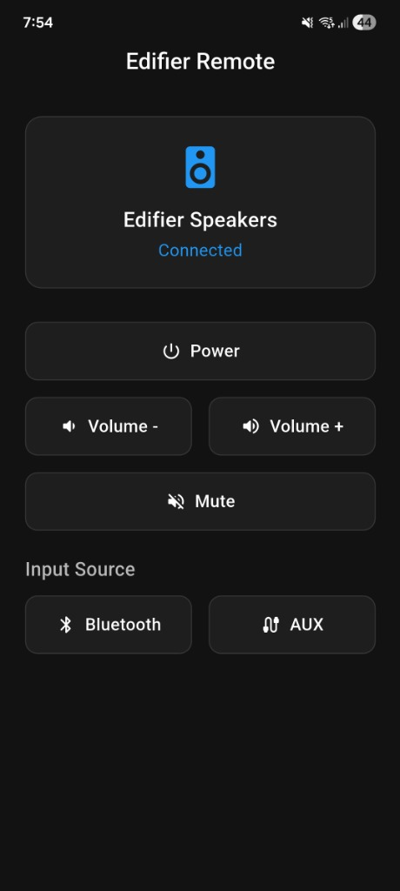

# Edifier Speaker Control App & ESPHome Remote

A high-performance, custom-built Flutter companion application and ESPHome configuration designed to manage Edifier speaker functions (Power, Volume, Mute, Bluetooth/AUX inputs) via **Home Assistant**.

<p align="center">
  
</p>

This project provides a complete end-to-end solution:
1.  **Flutter Android Application**: A mobile remote app with haptic feedback and interactive Home Screen Widgets.
2.  **ESPHome Firmware**: A configuration for an ESP32 board wired to an Infrared (IR) transmitter, which simulates the physical Edifier remote control signals.

---

## 🛠️ Technical Features & Implementation

*   **Custom Gestural Remote UI**: A responsive, modern Material 3 dark-themed user interface optimized for single-handed control.
*   **Haptic Feedback Integration**: Implements physical device vibration (haptic feedback) on key presses to simulate tactile button interactions.
*   **Interactive Home Screen Widgets**: Complete integration of the `home_widget` package, enabling widgets on the Android launcher screen. Users can toggle power, mute, or adjust volume directly from the home screen via interactive background service callbacks.
*   **Debounced Continuous Press Volume Control**: Implements a custom timer mechanism (`Timer.periodic`) to handle volume up/down repeating commands on hold, mimicking a physical remote control button hold.
*   **Home Assistant REST API Integration**: Communicates securely with Home Assistant using Long-Lived Access Tokens (JWT) and HTTP POST requests to trigger button entity services (`button.press`).
*   **Background Callback Handler**: Includes an entry-point compilation pragma (`@pragma("vm:entry-point")`) to process background service actions when triggered from the Android system widgets.
*   **Custom ESPHome IR Transmitter**: The ESP32 acts as a smart node, mapping virtual buttons in Home Assistant to raw NEC Infrared protocol signals matching the Edifier remote commands.

---

## 🔌 Hardware Mappings (ESPHome)

The ESPHome node runs on an **ESP32 Dev Module** with the following pin configuration (see [esp32-ir-remote.yaml](file:///c:/Users/lefte/Desktop/esp_speaker_control/esp32-ir-remote.yaml)):
*   **IR Receiver**: GPIO 14 (used for dumping and learning remote codes)
*   **IR Transmitter**: GPIO 4 (used for sending commands to the speakers)

---

## ⚙️ Configuration & Setup

### 1. ESP32 ESPHome Configuration
1.  Open [esp32-ir-remote.yaml](file:///c:/Users/lefte/Desktop/esp_speaker_control/esp32-ir-remote.yaml).
2.  Fill in your WiFi credentials, fallback AP settings, and OTA password:
    ```yaml
    wifi:
      ssid: "YOUR_WIFI_SSID"
      password: "YOUR_WIFI_PASSWORD"
    ```
3.  Flash the file to your ESP32 board using ESPHome dashboard or CLI.
4.  Once compiled and connected, Home Assistant will automatically discover the new integration and expose the Edifier control buttons.

### 2. Flutter App Connection
Modify the configuration variables in [lib/main.dart](file:///c:/Users/lefte/Desktop/esp_speaker_control/lib/main.dart):
1.  Set `homeAssistantUrl` to your local or public Home Assistant address:
    ```dart
    const String homeAssistantUrl = 'http://YOUR_HA_IP:8123';
    ```
2.  Set `accessToken` to your Long-Lived Access Token:
    ```dart
    const String accessToken = 'YOUR_LONG_LIVED_ACCESS_TOKEN';
    ```
    *(To generate a token: Home Assistant -> Profile -> Long-Lived Access Tokens -> Create Token)*

---

## 📦 Build Instructions

### Prerequisites
*   Flutter SDK installed (v3.0.0 or higher)
*   Android SDK / Android Studio configured

### Step-by-Step Build
1.  Navigate to the project root directory:
    ```bash
    cd esp_speaker_control
    ```
2.  Fetch packages and dependencies:
    ```bash
    flutter pub get
    ```
3.  Compile and build the release APK:
    ```bash
    flutter build apk --release
    ```
4.  The compiled package will be located at:
    `build/app/outputs/flutter-apk/app-release.apk`